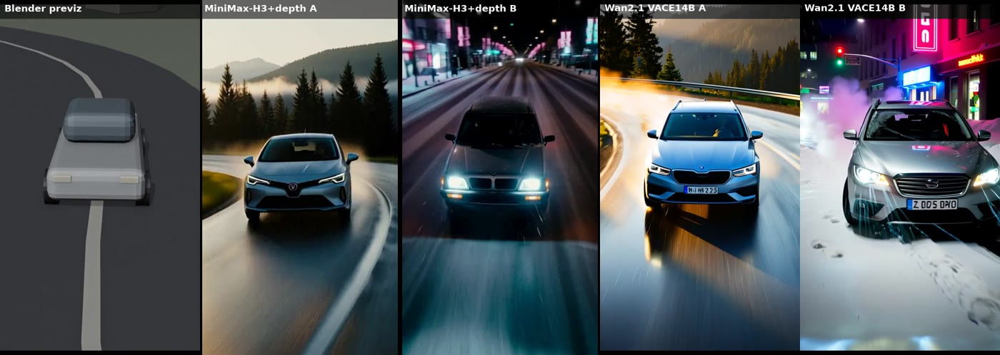
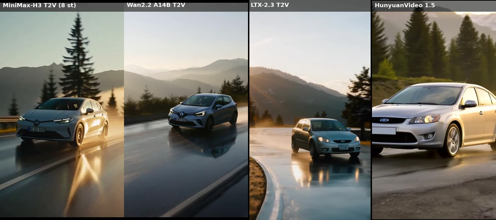
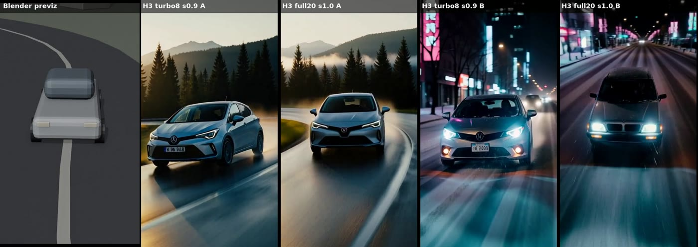

# Open video models vs. Seedance — real GPU-rental benchmark (Sept 2026)

We rented one **RTX PRO 6000 Blackwell 96 GB** on [Vast.ai](https://cloud.vast.ai/?ref_id=588745) for **56 minutes / $2.18** and ran the
strongest open-weights video models side by side — text-to-video and **depth-controlled from a Blender previz** — plus
ACE-Step 1.5 XL music. All clips, timings, VRAM peaks and costs are in this repo.

**Rent the same GPUs:** 👉 **[Vast.ai (referral link)](https://cloud.vast.ai/?ref_id=588745)** — tip: pick a host *without* inbound-traffic billing
(downloading ~245 GB of weights cost us $0.64 = 30 % of the bill).

## TL;DR

| Model / mode | Res | Time per 5 s clip | Peak VRAM | ≈ cost per clip (rented) | Verdict |
|---|---|---|---|---|---|
| **MiniMax-H3 T2V, 8-step turbo LoRA, native audio** | 480×832 | **51 s** | 59 GB | **$0.02** | best — looks like real footage |
| **MiniMax-H3 + depth ControlNet (previz), no turbo, strength 1.0** | 704×1280 | ~6.4 min | 96 GB | $0.17 | best previz fidelity (road, car, camera orbit) |
| MiniMax-H3 + depth, turbo | 480×832 | ~65 s | 72 GB | $0.03 | weak control |
| Wan2.1-VACE-14B + depth | 480×832 | ~2 min | 92–97 GB | $0.05 | real car, but over-sharpened / CGI look |
| Wan2.2-A14B T2V | 480×832 | 5 min | 96 GB | $0.14 | realistic but hazy |
| LTX-2.3 T2V, native audio | 704×1280 | 33 s | 95 GB | $0.015 | clean but generic |
| HunyuanVideo 1.5 | 480p | ~4 min | 33 GB | $0.11 | solid, below H3 |

vs. APIs (per 10 s): MiniMax-H3 $0.80–1.30 · Wan 2.2 $0.80 · LTX-2.5 Fast $0.90 · Seedance 2.5 $2.3–4.7. **Batch rental is ~10–20× cheaper.**

Key findings: H3 needs **80–96 GB VRAM** (no 4090/5090); previz control on H3 only bites at strength 0.9–1.0; give the blockout car a clear
front (H3 may flip direction); negative-prompt brand logos/plates (models draw look-alike badges); LTX-2.5 is gated on HF (we used 2.3).
Music: ACE-Step XL-sft rendered 6×34 s tracks in 18 s — objectively **darker/warmer**, not "better", than the SFT model (see `music/metrics.json`).

Side-by-sides: `previews/*.jpg` (inline below) and `clips/*.mp4`.

## Authors

- **magaz.dev lab** — idea, direction, budget, review.
- **Claude (Anthropic, Claude Opus 5.5)** — experiment design, Blender previz, orchestration of the GPU session, measurements, analysis and write-up (via Claude Code agents).

---

## 🇷🇺 Русская версия

Цель: проверить, можно ли делать AI-видео уровня «почти Seedance» на открытых моделях дешевле API, в т.ч. по нашей
Blender-болванке (превиз), и сравнить студийную музыку ACE-Step XL с нашей SFT.

## Сессия и деньги

| Параметр | Значение |
|---|---|
| Сервер | Vast.ai, **RTX PRO 6000 Blackwell 96 ГБ**, Япония, $1.625/ч, диск 280 ГБ |
| Время | 56 мин от создания до удаления |
| **Итого** | **$2.18** (GPU $1.47 · входящий трафик $0.64 за 245 ГБ весов · диск $0.05 · прочее $0.03) |
| Почему не A100 | шведская A100 ($1.06/ч) — старый драйвер 535/CUDA 12.2, текущий ComfyUI/torch не запускается |

Урок: выбирать хост **без платы за входящий трафик** (здесь это 30% счёта) и стартовать из готового Docker-образа (`bootstrap/`).

## Видео: замеры (5 с клип, 16–24 fps)

| Модель / режим | Разрешение | Время клипа | Пик VRAM | ≈ цена клипа (аренда) | Оценка |
|---|---|---|---|---|---|
| **MiniMax-H3 T2V, turbo 8 шагов, звук внутри** | 480×832 | **51 с** | 59 ГБ | **$0.02** | лучший: выглядит как настоящая съёмка |
| H3 + depth ControlNet (по болванке), turbo | 480×832 | 63–66 с | 72 ГБ | $0.03 | болванку держит слабо |
| H3 + depth, turbo | 704×1280 | 177–186 с | 96 ГБ | $0.08 | средне |
| **H3 + depth, без turbo, сила 1.0** | 704×1280 | **378–384 с** | 96 ГБ | **$0.17** | **лучше всех повторяет болванку**: изгиб дороги, машина, облёт камеры |
| Wan2.1-VACE-14B + depth (сила 0.5/0.7) | 480×832 | 117–120 с | 92–97 ГБ | $0.05 | реальная машина, но пересвечено, «CGI» |
| Wan2.2-A14B T2V | 480×832 | 300 с | 96 ГБ | $0.14 | реалистично, но мутно |
| LTX-2.3 T2V, звук внутри | 704×1280, 6 с | 33 с | 95 ГБ | $0.015 | чисто, но безлико |
| HunyuanVideo 1.5 | 480p | 237 с | 33 ГБ | $0.11 | неплохо, слабее H3 |

Сравнения (кадры — `previews/`, видео — `clips/`):
- `clips/sbs1_previz_h3_wan.mp4` — болванка | H3 сюжет A | H3 сюжет B | Wan14B A | Wan14B B  
  
- `clips/sbs2_t2v_models.mp4` — без болванки: H3 | Wan2.2 | LTX-2.3 | Hunyuan 1.5  
  
- `clips/sbs3_h3_turbo_vs_full.mp4` — H3 turbo против полных 20 шагов  
  
- Исходная болванка: `clips/previz_blender_color.mp4`.

### Сравнение с API (за 10 с видео)

| | Аренда (пачкой) | API |
|---|---|---|
| MiniMax-H3 | ≈ $0.04 (turbo) … $0.35 (по болванке, полное качество) | $0.80 (768p) / $1.30 (2K) |
| Wan 2.2 14B | ≈ $0.10–0.30 | $0.80 (WaveSpeed) |
| LTX | ≈ $0.03 | $0.90 (LTX-2.5 Fast, fal) |
| Seedance 2.5 | — (закрытая) | $2.3–4.7 |

Плюс накладные на сессию: ~10–16 мин загрузки весов (≈$0.3–0.5) — окупается от ~5 клипов. С готовым образом — ~5 мин.

## Музыка: ACE-Step XL-sft против нашей SFT

XL: 6 треков по 34 с (50 шагов, CFG 7) за **18 с** на этой карте. SFT — наша библиотека (генерится бесплатно на своей RTX 3080, ~30 с/трек).
Слушать: `music/AB_sft_vs_xl.mp3` — пары по 10 с: Кубышка SFT → XL, Авто SFT → XL, После 40 SFT → XL.
Все треки отмастерены одинаково (−14 LUFS), поэтому «на слух» разница не громкостная. Объективно (`music/metrics.json`):

| | XL (6 треков) | SFT (9 треков) |
|---|---|---|
| Спектральный центроид («яркость») | 2.4–3.6 кГц | 3.0–5.7 кГц |
| Доля верхов > 8 кГц | 0.07–0.17 | 0.09–0.32 |
| Плоскость 2–8 кГц («воздух/текстура») | 0.58–0.72 | 0.67–0.78 |
| Ширина стерео (S/M) | 0.48–0.79 | 0.37–0.67 |
| Динамика (crest), дБ | 12.8–16.9 | 14.0–16.7 |

**Вывод по музыке:** XL не «лучше», а **темнее и теплее**; SFT ярче и «воздушнее» — на телефонах это обычно звучит чище.
Основной остаётся **SFT** (бесплатно, локально). XL — для тёплых кинематографичных жанров, генерировать попутно, когда
сервер арендован под видео (6 треков = 18 с).

## Выводы по видео

1. **MiniMax-H3 — явный победитель** среди открытых моделей (сентябрь 2026). T2V turbo со звуком — ≈$0.02 за 5 с и качество «как съёмка».
2. **Схема «Blender-болванка → видео» работает** на H3 + depth ControlNet, но только при силе 0.9–1.0 и без turbo (≈6.5 мин/клип, ≈$0.17).
3. Болванке нужен явный «перёд» (фары, наклон стекла) — иначе H3 иногда разворачивает машину к камере; при силе 1.0 машина копирует угловатую форму блока → болванку делать ближе к реальным пропорциям.
4. Модели рисуют похожие на настоящие **логотипы и номера** → негатив в промпте + размытие перед публикацией (товарные знаки).
5. H3 требует **80–96 ГБ VRAM** (59–96 ГБ пик) → RTX 5090/4090 не подходят; брать A100 80 ГБ / RTX PRO 6000 96 ГБ / H100.
6. LTX-2.5 на Hugging Face — по заявке (gated), наш аккаунт не одобрен; тестировали LTX-2.3.
7. На карте 12 ГБ качественное AI-видео этими моделями невозможно — только аренда 80–96 ГБ или API.

## Авторы

- **magaz.dev lab** — идея, постановка, бюджет, проверка.
- **Claude (Anthropic, Claude Opus 5.5)** — дизайн эксперимента, Blender-болванка, управление GPU-сессией, замеры, анализ и отчёт (через агентов Claude Code).

## Что дальше

- Болванки под промо каналов (дорога, кухня, дом, город) с реалистичными пропорциями и явным «передом».
- Пакетная сессия: 10–20 роликов (H3 по болванкам + H3 T2V), ≈$1–2 за сессию.

---
**Licenses / notes.** Clips and music here are our own generations, published for research/comparison (CC BY 4.0). Each model keeps its
own license: MiniMax-H3 (custom licence with regional restrictions — check it before commercial use), Wan (Apache-2.0), LTX (Lightricks
open-weights licence), HunyuanVideo (Tencent licence), ACE-Step (MIT). Brand-like badges in some clips are model hallucinations.
The Vast.ai link above is a referral link.
